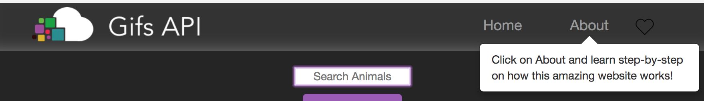

# Gifs API 

## Overview
The Gifs API was created with the intention to create an awesome experience to the user. All the GIFS are provided by Giphy.com, which is the largest GIF library in the world. Gifs API also offers the Favorites Page for you to save the funniest GIFS ever! Have Fun! 

---
## Instructions
 
To generate gifs, click on the buttons already premade or choose an animal of your choice on search bar. To delete, double click on the button. 
To animate, double click on the gif of your choice!

---

On the home page, if you would like to save a gif click on the outline heart. To see all your favorited gifs go to the Favorites Page (top right hand corner). The gifs are save on Local Storage.

---

* *Please visit Gifs API, on About Page to learn more features.*

---

## Built With 
- [Giphy API](https://developers.giphy.com/docs/)
- [Bootstrap v3.3.7](https://getbootstrap.com/docs/3.3/getting-started/)
